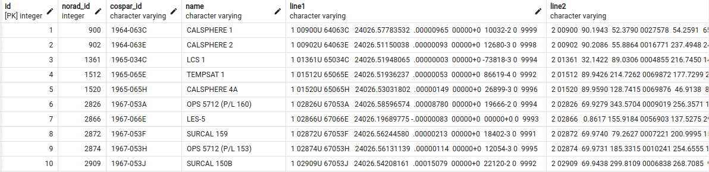

Rename files and edit files:
- `.secrets.yaml.template` -> `.secrets.yaml`
- `settings.yaml.template` -> `settings.yaml`

```commandline
python3 main.py
```

The generated table will look like this:



Table columns:

- id
- norad_id
- cospar_id
- name
- line1
- line2
- epoch
- mean_motion
- eccentricity
- inclination
- ra_of_asc_node
- arg_of_pericenter
- mean_anomaly
- ephemeris_type
- classification_type
- element_set_no
- rev_at_epoch
- bstar
- mean_motion_dot
- mean_motion_ddot
- last_update
- geom
