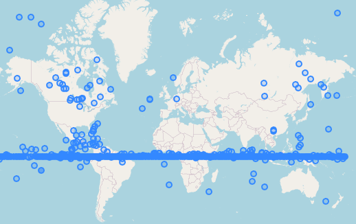

# celestrak-satellites-tle-scrapping

Scrapper for celestrak active satellites data.

## Configuration file
Rename files and edit files:
- `.secrets.toml.template` -> `.secrets.toml`
- `settings.toml.template` -> `settings.toml`

## Install dependecies
```commandline
pip install -r requirements.txt
```

## Execute SQL

As postgres user:

```commandline
psql <your-database> -f database.sql
```

Or just copy and paste inside pgadmin4.

## Run

```commandline
python3 main.py
```

## Final result




## PostgreSQL SPG4 integration

Install:

https://github.com/gabriel-russo/postgresql-sgp4

And run:

```commandline
psql <your-database> -f postgresql-sgp4-integration.sql
```
